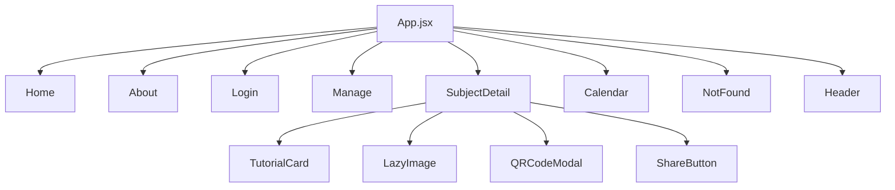

# TutorTime - Requirements Matrix Diagram

## System Overview

TutorTime é um sistema de gerenciamento de monitorias para instituições de ensino, especificamente desenvolvido para o Instituto Federal de São Paulo (IFSP). O sistema permite que professores e coordenadores cadastrem monitorias para diferentes disciplinas, e que alunos possam visualizar e se inscrever nessas monitorias.

## Matriz de Requisitos

### 1. Requisitos Funcionais

| ID   | Requisito                      | Descrição                                                                              | Prioridade | Implementado | Dependências |
| ---- | ------------------------------ | -------------------------------------------------------------------------------------- | ---------- | ------------ | ------------ |
| RF01 | Visualização de Matérias       | Usuários podem visualizar a lista de matérias disponíveis para monitorias              | Alta       | ✅           | -            |
| RF02 | Detalhes de Monitoria          | Usuários podem ver informações detalhadas sobre monitorias específicas                 | Alta       | ✅           | RF01         |
| RF03 | Filtro de Monitorias           | Usuários podem filtrar monitorias por dia e local                                      | Média      | ✅           | RF02         |
| RF04 | Busca de Monitorias            | Usuários podem realizar busca textual nas monitorias                                   | Média      | ✅           | RF02         |
| RF05 | Inscrição em Monitorias        | Alunos podem se inscrever nas monitorias                                               | Alta       | ✅           | RF02         |
| RF06 | Gestão de Matérias             | Administradores podem adicionar, editar e excluir matérias                             | Alta       | ✅           | -            |
| RF07 | Gestão de Monitorias           | Administradores podem adicionar, editar e excluir monitorias                           | Alta       | ✅           | RF06         |
| RF08 | Calendário de Monitorias       | Visualização das monitorias em formato de calendário por dia da semana                 | Média      | ✅           | RF01, RF02   |
| RF09 | Compartilhamento de Monitorias | Usuários podem compartilhar detalhes de monitoria via QR code, link, WhatsApp ou email | Baixa      | ✅           | RF02         |
| RF10 | Acesso Administrativo          | Sistema restringe acesso às funcionalidades de gestão através de senha                 | Alta       | ✅           | -            |
| RF11 | Distribuição de Monitorias     | Visualização da distribuição quantitativa de monitorias por dia                        | Baixa      | ✅           | RF08         |
| RF12 | Responsividade                 | Interface adapta-se a diferentes tamanhos de tela                                      | Alta       | ✅           | -            |
| RF13 | Normalização de Dias           | Sistema normaliza diferentes grafias para dias da semana                               | Média      | ✅           | -            |
| RF14 | Gerenciamento de Monitores     | Associação de monitores a monitorias específicas                                       | Alta       | ✅           | RF07         |
| RF15 | Gerenciamento de Professores   | Associação de professores orientadores a monitorias                                    | Alta       | ✅           | RF07         |

### 2. Requisitos Não-Funcionais

| ID    | Requisito         | Descrição                                                            | Prioridade | Implementado | Observações                                    |
| ----- | ----------------- | -------------------------------------------------------------------- | ---------- | ------------ | ---------------------------------------------- |
| RNF01 | Performance       | Sistema responde rapidamente às interações do usuário                | Alta       | ✅           | Uso de Lazy Loading e componentes memoizados   |
| RNF02 | Estética e Design | Interface moderna e atrativa com elementos visuais consistentes      | Alta       | ✅           | Uso de TailwindCSS e design system consistente |
| RNF03 | Usabilidade       | Sistema fácil de usar com atalhos de teclado e feedback visual claro | Alta       | ✅           | Implementação de atalhos e notificações        |
| RNF04 | Acessibilidade    | Interface acessível para diferentes tipos de usuários                | Média      | ⚠️           | Parcialmente implementado                      |
| RNF05 | Manutenibilidade  | Código organizado para facilitar manutenção                          | Alta       | ✅           | Estrutura de componentes React bem definida    |
| RNF06 | Compatibilidade   | Sistema funciona em diferentes navegadores e dispositivos            | Alta       | ✅           | -                                              |
| RNF07 | Segurança         | Proteção de acesso às funcionalidades administrativas                | Média      | ⚠️           | Implementação básica com senha simples         |

### 3. Integração entre Componentes

## Fluxo de Dados Principal

### 1. Visualização de Monitorias

1. Usuário acessa a página inicial (Home)
2. Sistema exibe carrossel de matérias disponíveis
3. Usuário seleciona uma matéria
4. Sistema redireciona para página de detalhes (SubjectDetail)
5. Sistema exibe lista de monitorias filtráveis para a matéria selecionada

### 2. Gestão de Monitorias

1. Usuário acessa página de administração (Login)
2. Usuário insere credenciais (senha: "admin")
3. Sistema valida credenciais e redireciona para painel administrativo (Manage)
4. Usuário realiza operações de adicionar/editar/excluir matérias ou monitorias
5. Sistema atualiza o banco de dados e reflete as mudanças na interface

## Pontos de Melhoria Identificados

1. **Segurança**: Implementação de sistema de autenticação mais robusto
2. **Acessibilidade**: Melhorar suporte a leitores de tela e navegação por teclado
3. **Persistência de Dados**: Implementar armazenamento local para melhorar experiência offline
4. **Notificações**: Implementar sistema de notificações para lembrar usuários de monitorias agendadas
5. **Testes Automatizados**: Adicionar testes unitários e de integração

## Conclusão

O sistema TutorTime apresenta uma arquitetura bem estruturada com clara separação de responsabilidades entre componentes. A aplicação React oferece uma interface moderna e responsiva que atende às necessidades dos usuários finais. As principais funcionalidades estão implementadas e funcionais, embora existam oportunidades de melhoria em aspectos de segurança e acessibilidade.

A arquitetura do sistema é baseada em uma API RESTful que serve dados para o frontend React, permitindo operações CRUD completas para gerenciamento de monitorias e matérias.
